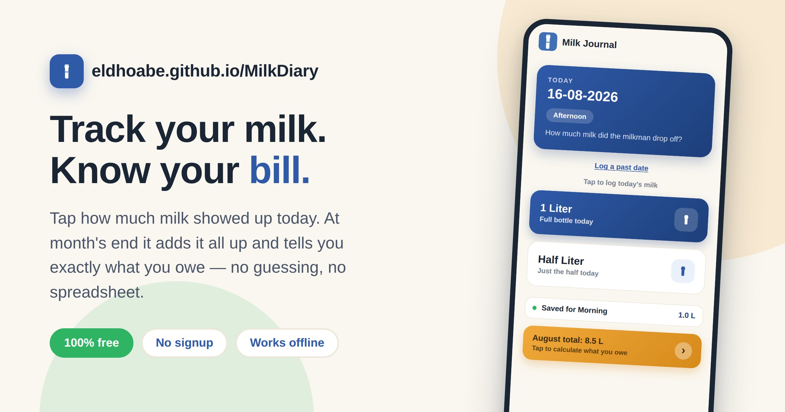
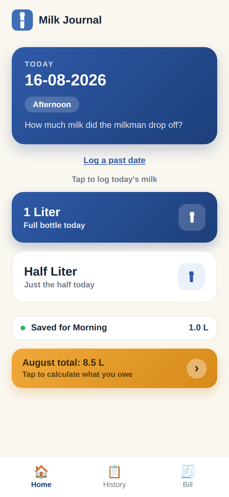
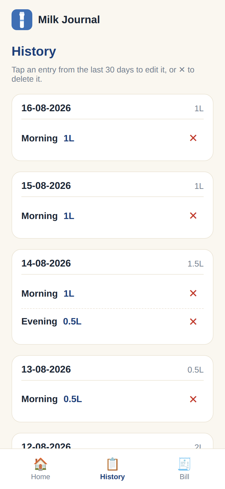
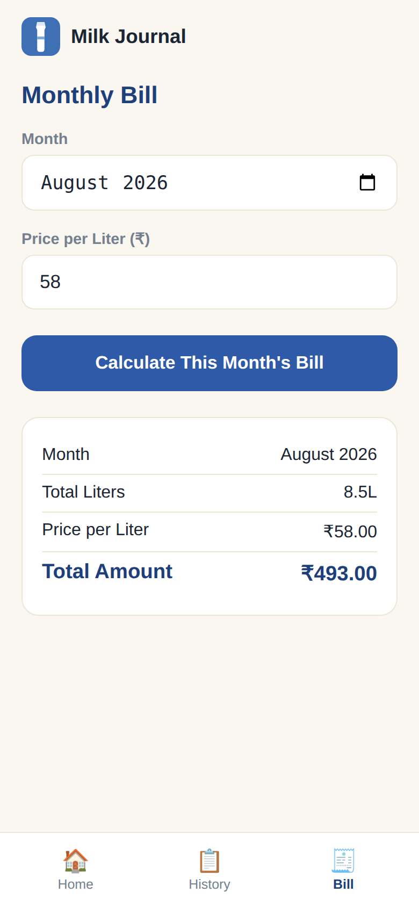
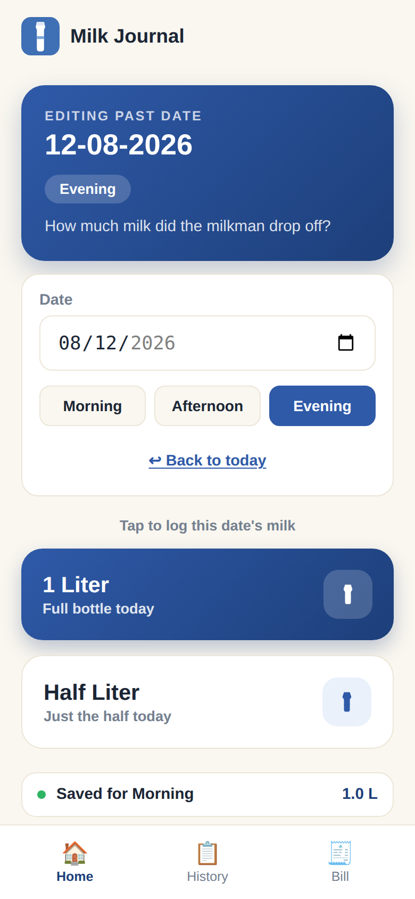

# Milk Journal



Every month it's the same fight: the milkman says one number, your fuzzy
memory says another, and somewhere there's a scrap of paper with tally
marks that's either lost or wrong. Milk Journal replaces that scrap of
paper. Tap how much milk showed up today, and at the end of the month it
adds it all up and tells you exactly what you owe — no guessing, no
arguing, no spreadsheet.

It's a tiny, mobile-friendly app for logging daily milk purchases and
working out what you owe at the end of the month. Open it, tap a button,
done.

**100% free — no signup, no ads, no subscription, open source.**

**Try it now: [MilkJournal.in](https://milkjournal.in/)**

| | | |
|---|---|---|
|  |  |  |

## What it does

- **Log milk in one tap.** Open the app and it already knows today's date
  and whether it's Morning, Afternoon, or Evening. Tap **1 Liter** or
  **Half Liter** to save it.
- **Won't double-count.** Tapping again for the same time period updates
  that entry instead of adding a duplicate — safe to tap twice if you're
  not sure it saved.
- **Catch up on missed days.** Forgot to log yesterday, or the day before?
  Use **Log a past date** on the Home screen to pick any date and time
  period from the last 30 days and log or correct it.
  
- **Full history, editable.** The History tab lists every entry grouped by
  date with daily totals. Tap an entry to fix a mistake, or hit ✕ to delete
  it.
- **Monthly bill in one tap.** The Bill tab totals every liter logged for
  the month you pick, multiplies by your price per liter, and shows the
  total to pay.

## Getting started

1. Open **[milkjournal.in](https://milkjournal.in/)**
   on your phone.
2. Add it to your home screen so it opens like a regular app:
   - **iPhone (Safari):** tap the Share icon → **Add to Home Screen**
   - **Android (Chrome):** tap the ⋮ menu → **Add to Home screen**
3. Every morning (or evening), open it and tap how much milk you got.
   That's the whole habit.
4. At the end of the month, go to the **Bill** tab, enter the price per
   liter, and tap **Calculate This Month's Bill**.

All entries are stored locally in your browser (`localStorage`) — nothing
is sent to a server, and there's no account. That also means each device
keeps its own separate log; it isn't shared or synced between phones.

## Local development

No build step, no dependencies — it's plain HTML/CSS/JS.

```
git clone https://github.com/eldhoabe/MilkDiary.git
cd MilkDiary
python3 -m http.server 8000
```

Then open `http://localhost:8000` in a browser (use its device toolbar to
preview at a phone width).

## Tech

- Single-page app: `index.html`, `style.css`, `app.js`
- Data persistence via `localStorage`
- `manifest.json` + `sw.js` for basic PWA / "Add to Home Screen" support

## License

MIT — see [LICENSE](LICENSE). Free to use, free to read, free to fork.
